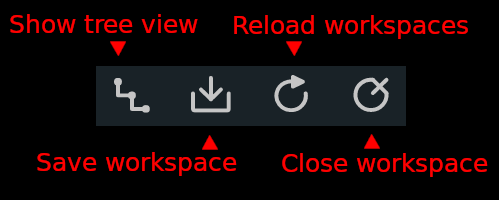
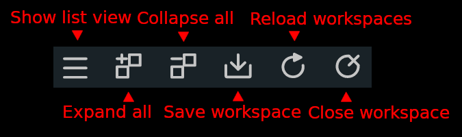
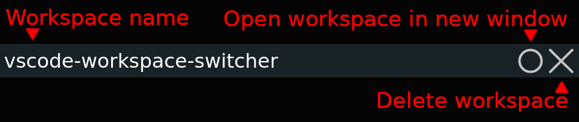
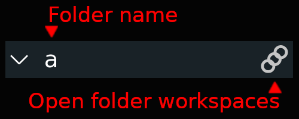

# vscode-workspace-switcher

Easily switch between workspaces

## How to use

1. Set the extension's configuration option `vscodeWorkspaceSwitcher.paths` to an array of folder globs, representing the folders where your `.code-workspace` files are stored
2. Save a workspace file (`.code-workspace`)
    * Use the `W`-shaped icon in the Activity Bar and then click on the icon the view's title bar,
    * or, use the extension's subsection in Explorer, in the same way,
    * or, use the `Ctrl-k Shift-w` chord,
    * or, save it manually using VS Code's File menu
3. Open any of your saved workspaces in the current window
    * Use the `W`-shaped icon in the Activity Bar and then click on name of the workspace you want to open,
    * or, use the extension's subsection in Explorer, in the same way,
    * or, use the `Ctrl-k w` chord
4. Open any of your saved workspaces in a new window
    * Use the `W`-shaped icon in the Activity Bar and then click on the `O`-shaped icon next to the name of the workspace you want to open,
    * or, use the extension's subection in Explorer, in the same way,
    * or, Use the `Ctrl-k Ctrl-w` chord

When using a `folder/name` path as the workspace's file name, the `folder` prefix is automatically created before the workspace file is saved.

## Configuration

This extension contributes the following settings:

* `vscodeWorkspaceSwitcher.paths`
    * Array of folder globs, representing the folders where your `.code-workspace` files are stored
    * These folder globs will also be used to select where to create a `.code-workspace` file for the current workspace
* `vscodeWorkspaceSwitcher.showInActivityBar`
    * Boolean controlling whether or not the workspaces will be shown in a separate view in the Activity Bar
* `vscodeWorkspaceSwitcher.showInExplorer`
    * Boolean controlling whether or not the workspaces will be shown in a subsection in the Explorer
* `vscodeWorkspaceSwitcher.showDeleteWorkspaceButton`
    * Boolean controlling whether or not a workspace entry's `Delete Workspace` button is shown in the Acitivity Bar or in the Explorer
* `vscodeWorkspaceSwitcher.showTreeView`
    * Boolean controlling whether to show the list view or the tree view in the Acitivity Bar or in the Explorer

## Commands

This extension contributes the following commands:

* `Save Workspace`
    * Save the current workspace to a `.code-workspace` file
* `Open Workspace`
    * Select a workspace and open it in the current window
* `Open Workspace in New Window`
    * Select a workspace and open it in a new window
* `Delete Workspace`
    * Delete a workspace
* `Reload Workspaces`
    * Reload the list of workspaces
* `Close Workspace`
    * Close the currently open workspace

## Views

* Activity Bar
    * The `W`-shaped icon in the Activity Bar toggles the workspaces as a list or as a tree view
    * The icon's visibility can be controlled through the `vscodeWorkspaceSwitcher.showInActivityBar` extension setting
* Explorer
    * There is a subsection in Explorer which shows the workspaces as a list or as a tree view
    * The subsection's visibility can be controlled through the `vscodeWorkspaceSwitcher.showInExplorer` extension setting
* List view buttons

    

* Tree view buttons

    

* Workspace entry buttons

    

* Folder entry buttons

    

## Key bindings

This extension contributes the following key bindings:

* `Ctrl-k Shift-w`
    * Save the current workspace to a `.code-workspace` file
* `Ctrl-k w`
    * Open workspace in current window
* `Ctrl-k Ctrl-w`
    * Open workspace in new window

## Dependencies

* `fast-glob` is used for file name globbing of the paths set through the `vscodeWorkspaceSwitcher.paths` setting
* `mkdirp` is used when saving a new workspace file and a `folder/name` path is used